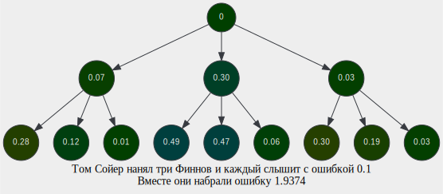

# Calc

Программа для создания симмуляции работы Тома Сойера и Геккельберри Финна.
Том Сойер приказывает многим Финнам раскрасить забор, но каждый слышит с
поправкой на ошибку _error_. После чего создаётся граф с забором где наверху Том
Сойер а внизу покрашенный забор Финнами.
Сойер и Финн могут нанять еще _childCount_ Финнов и выстроить иерархию глубиной
_deep_.

Для запуска симуляции надо вызвать 

```
npm run calc
```  

Программа использует пакет *dot*, *open* и *nodejs*.

Результат последнего запуска:


